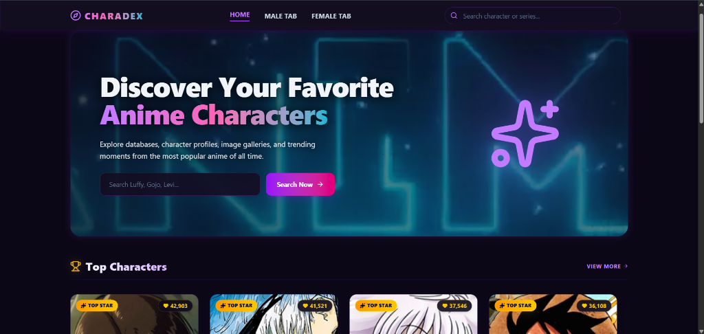
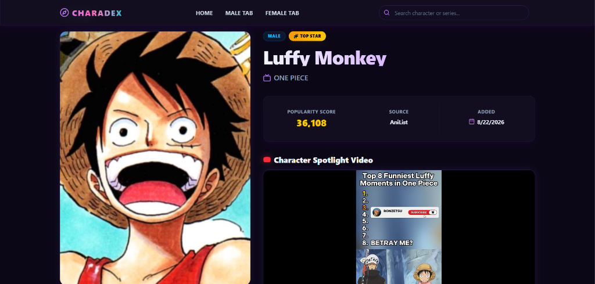

# ⚡ CharaDex — Anime Character Database & Spotlight Portal

<p align="center">
  <b>A modern, dynamic anime character catalog with immersive video spotlights, real-time AniList integration, and a cyberpunk dark aesthetic.</b>
</p>

<p align="center">
  <b>Built by Divyam</b>
</p>

---

## 📸 Screenshots

### 🏠 Homepage & Hero Spotlight


### 👤 Character Profile & Video Spotlight


---

## ✨ Features

- **🎬 Netflix-Style Video Opener**: Cinematic full-screen video intro sequence that plays smoothly when launching the website.
- **🌌 Cyberpunk Dark Theme**: Deep dark obsidian background, glassmorphism cards, glowing neon purple/cyan accents, and an animated looping hero background video.
- **🔍 Instant Search & Series Filters**: Fast search query engine with live filtering across popular anime series (One Piece, Jujutsu Kaisen, Attack on Titan, Frieren, etc.).
- **🏆 Top Characters & Fan Favorites**: Horizontally scrollable spotlight rows tracking popularity scores and specialty badges (*Top Star*, *Fan Favorite*).
- **🚻 Gender Portals**: Dedicated **Male** and **Female** character catalog tabs with series dropdown selectors.
- **🎥 Character Spotlight Player**: Automatic character moment / highlight video integration that plays spotlights directly inside the profile view.
- **🛡️ Auto-Repairing Database**: Automatically fetches and caches missing video highlights and metadata from AniList GraphQL directly into MongoDB Atlas.

---

## 🛠️ Tech Stack

### Frontend
- **React 18** (Vite)
- **Tailwind CSS v4** (Custom cyberpunk theme, glassmorphism utilities, neon glows)
- **React Router v6**
- **Lucide React** (Vector icons)
- **Axios**

### Backend
- **Node.js & Express**
- **MongoDB Atlas** (Cloud Database via Mongoose)
- **AniList GraphQL API**
- **Smart Keyless Video Resolver Pipeline**

---

## 🚀 Getting Started

### 1. Prerequisites
- Node.js (v18+ recommended)
- MongoDB Atlas connection string (or local MongoDB)

### 2. Setup Environment
Create a `.env` file in the root directory:
```env
PORT=5000
MONGO_URI=your_mongodb_connection_string
```

### 3. Install Dependencies
```bash
# Install backend dependencies
npm install

# Install frontend dependencies
cd frontend
npm install
cd ..
```

### 4. Run the Project
In two separate terminals:

**Backend Server:**
```bash
node server.js
# Runs on http://localhost:5000
```

**Frontend App:**
```bash
cd frontend
npm run dev
# Runs on http://localhost:5173
```

---

## 👤 Author

Built by **Divyam**
- GitHub: [@DivyamTheDev](https://github.com/DivyamTheDev)
- Repository: [CharaDex](https://github.com/DivyamTheDev/CharaDex)
